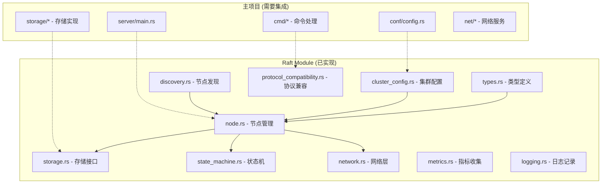
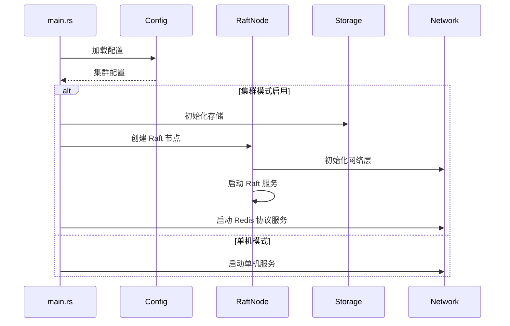

# Kiwi Raft 集成设计文档

## 概述

本文档描述了将现有 Kiwi Raft 模块完全集成到 Kiwi 数据库中的设计方案。当前 Raft 模块已有完整的架构设计，包括类型定义、网络层、存储层、状态机等组件，但由于编译错误被临时禁用。本设计旨在修复这些问题并实现完整的集群功能。

## 当前架构分析

### 已实现的组件



### 当前问题分析

1. **编译错误**: Raft 模块被注释掉，无法编译
2. **依赖缺失**: 某些内部依赖可能未正确配置
3. **集成缺失**: 主服务器未完全集成 Raft 功能
4. **配置不完整**: 集群配置解析可能不完整

## 集成设计方案

### 1. 编译错误修复

**问题定位**:
- 检查所有模块的依赖关系
- 修复类型不匹配问题
- 解决循环依赖

**解决方案**:
```rust
// 在 Cargo.toml 中重新启用 raft 模块
members = [
    // ... 其他模块
    "src/raft"  // 取消注释
]

// 修复内部依赖
[dependencies]
kstd = { path = "../kstd" }
storage = { path = "../storage" }
engine = { path = "../engine" }
// 确保所有路径正确
```

### 2. 存储层集成设计

**当前状态**: KiwiStateMachine 已定义但未与实际存储集成

**集成方案**:
```rust
impl KiwiStateMachine {
    pub async fn apply_command(&mut self, command: &RedisCommand) -> Result<Bytes, String> {
        match command.command.as_str() {
            "SET" => {
                let key = &command.args[0];
                let value = &command.args[1];
                // 调用实际的存储层
                self.storage.set(key, value).await
            }
            "GET" => {
                let key = &command.args[0];
                self.storage.get(key).await
            }
            // ... 其他命令
        }
    }
}
```

### 3. 服务器启动集成

**当前状态**: main.rs 中 Raft 初始化被注释

**集成流程**:


### 4. 配置管理设计

**配置文件结构**:
```toml
# cluster.conf
[server]
port = 7379
binding = "127.0.0.1"

[cluster]
enabled = true
node_id = 1
members = ["1:127.0.0.1:7379", "2:127.0.0.1:7380", "3:127.0.0.1:7381"]
data_dir = "./raft_data"
heartbeat_interval_ms = 1000
election_timeout_min_ms = 3000
election_timeout_max_ms = 6000
```

**配置解析**:
```rust
impl Config {
    pub fn load_cluster_config(&mut self, path: &str) -> Result<(), Error> {
        // 解析集群配置
        // 验证配置有效性
        // 设置默认值
    }
}
```

### 5. 网络层集成

**HTTP API 设计**:
```
GET  /cluster/status     - 获取集群状态
POST /cluster/join       - 加入集群
POST /cluster/leave      - 离开集群
GET  /cluster/members    - 获取成员列表
GET  /metrics           - 获取性能指标
```

**Redis 协议集成**:
```rust
impl RedisProtocolCompatibility {
    pub async fn handle_command(&self, command: RedisCommand) -> Result<Bytes, String> {
        if self.is_cluster_command(&command) {
            self.handle_cluster_command(command).await
        } else {
            // 通过 Raft 提交命令
            self.raft_node.client_write(command).await
        }
    }
}
```

### 6. 错误处理和恢复

**错误类型**:
```rust
#[derive(Error, Debug)]
pub enum RaftIntegrationError {
    #[error("Configuration error: {0}")]
    Config(String),
    
    #[error("Network error: {0}")]
    Network(String),
    
    #[error("Storage error: {0}")]
    Storage(String),
    
    #[error("Raft error: {0}")]
    Raft(String),
}
```

**恢复策略**:
- 网络分区: 自动重连和状态同步
- 节点故障: 自动故障转移
- 数据损坏: 从快照恢复

## 实现步骤

### 阶段 1: 基础修复 (1-2 天)
1. 修复编译错误
2. 解决依赖问题
3. 基本功能测试

### 阶段 2: 核心集成 (3-5 天)
1. 存储层集成
2. 服务器启动集成
3. 配置管理完善

### 阶段 3: 功能完善 (5-7 天)
1. 网络层完善
2. 协议兼容性
3. 错误处理

### 阶段 4: 测试和优化 (2-3 天)
1. 集成测试
2. 性能测试
3. 文档完善

## 测试策略

### 单元测试
- 各模块独立功能测试
- 类型转换和序列化测试
- 配置解析测试

### 集成测试
- 三节点集群部署测试
- 故障转移测试
- 数据一致性测试

### 性能测试
- 吞吐量基准测试
- 延迟测试
- 资源使用测试

## 监控和可观测性

### 关键指标
- Raft 状态 (Leader/Follower/Candidate)
- 日志复制延迟
- 选举频率
- 网络分区检测

### 日志记录
- 结构化日志格式
- 不同级别的日志输出
- 关键事件审计

### 健康检查
- 节点存活检测
- 集群健康状态
- 自动故障恢复

这个设计确保了现有 Raft 模块的完整集成，同时保持了系统的稳定性和可维护性。