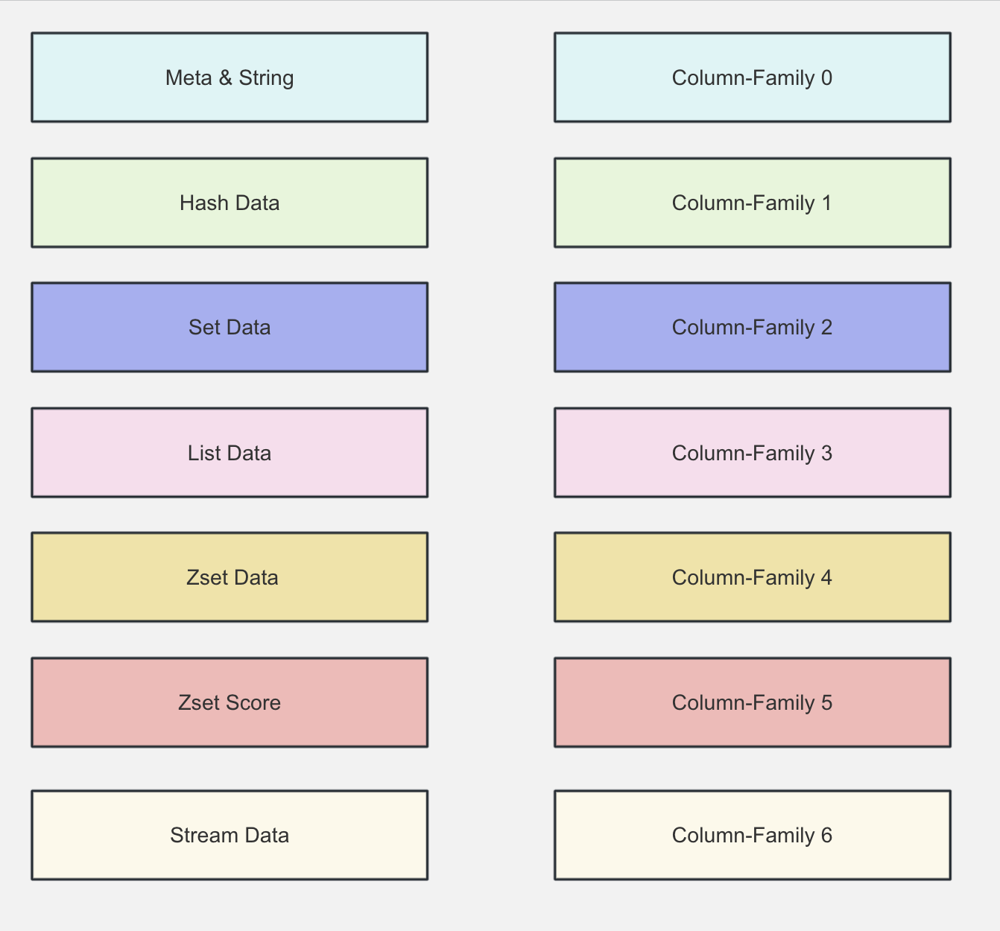
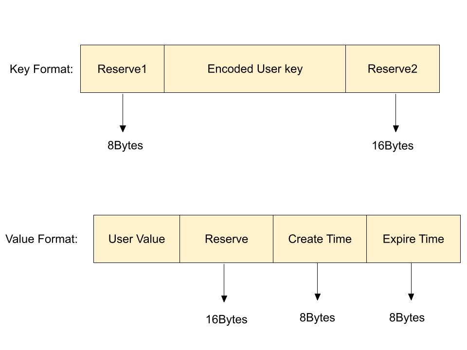
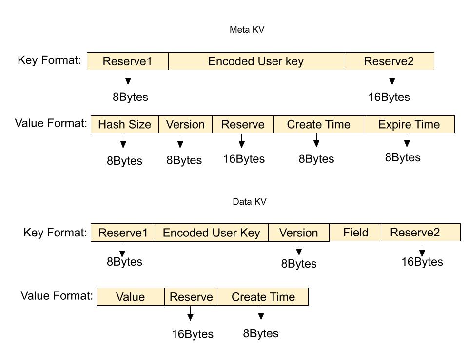
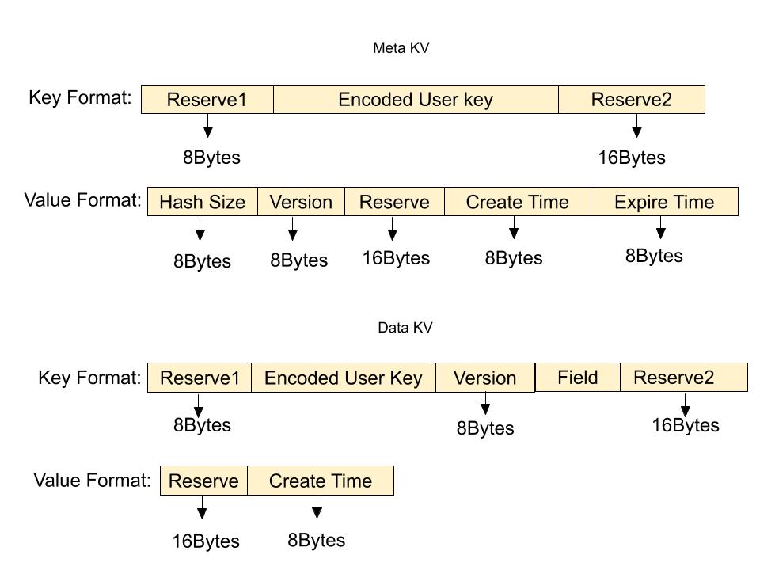
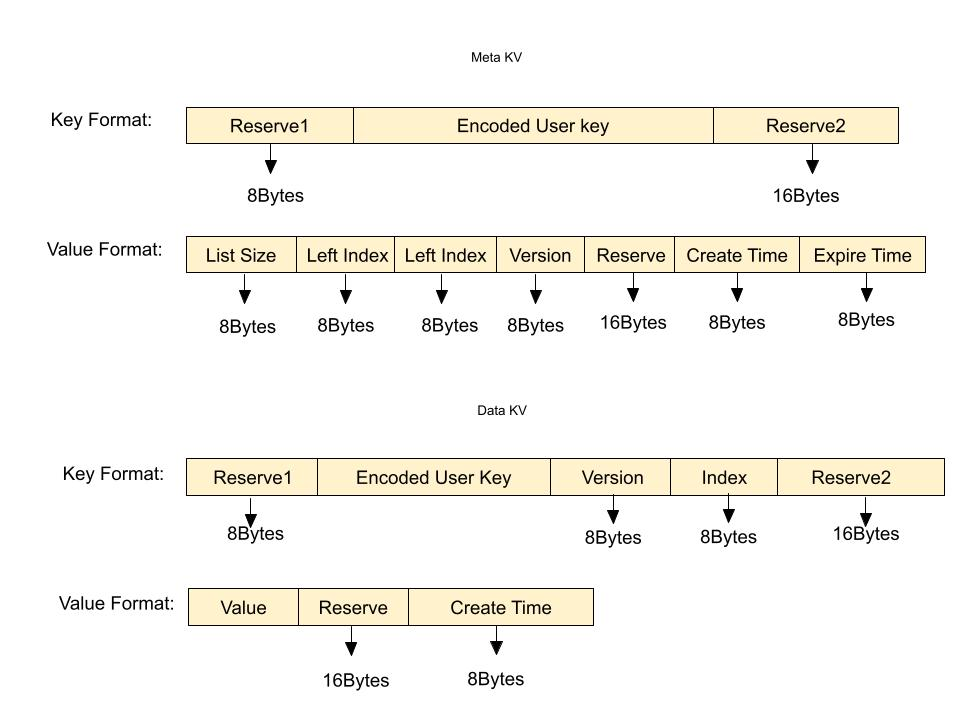
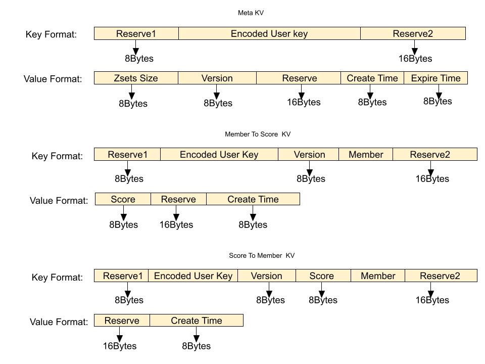

# key 编解码

参考：https://github.com/OpenAtomFoundation/pikiwidb/discussions/2052

## 数据类型与 CF 的关系

## String 结构的存储

## Hash 结构的存储

Hash 类型数据结构由两部分构成，元数据（meta_key，meta_value）和普通数据（data_key，data_value）。每个 Hash 类型数据对应一条元数据，每个 Filed 对应一条普通数据。具体格式如下图所示。

元数据中的 key 由前缀保留字段，编码后的 user key 以及后缀保留字段构成，value 中记录了 hash 中元素个数，最新版本号，保留字段，数据写入时间以及数据过期时间，version 字段用于实现秒删功能。

普通数据主要就是指的同一个 hash 表中一一对应的 field 和 value，普通数据的 key 字段依次拼接了保留字段，编码后的 user key，元数据中的最新 version，filed 字段以及后缀保留字段。value 则拼接了保留字段以及 field 写入时间。

当执行读写以及删除单个 field 操作时，首先获取元信息，之后解析出 version，再将主 key，version 和 field字段拼接得到最终的 data key，最后读写 data key。

当执行 HgetAll 时，首先获取元信息，接下来将主 key 与解析出的 version 拼接构成 data key 前缀，生成 RocksDB 迭代器遍历 Data Key。

当执行 Del 操作时，由于 Version 字段支持了秒删功能，因此生成一个新 Version 并将新的元信息写回到 RocksDB 中即可。无效的数据会随着 RocksDB 的 Compaction 逐渐被物理删除。

## Set 结构的存储

set 结构与 hash 类型的存储格式基本相同，也是由元数据和普通数据两部分构成。不同的是，set 类型由于没有 value字段，所以其 data value 中只需要记录保留字段和数据写入时间即可。具体格式如下所示：

## List 结构的存储

list 由两部分构成，元数据(meta_key, meta_value), 和普通数据(data_key, data_value)。 元数据中存储的主要是 list 链表的一些信息， 比如说当前 list 链表结点的的数量以及当前 list 链表的版本号和过期时间(用做秒删功能), 还有当前 list 链表的左右边界, 普通数据实际上就是指的 list 中每一个结点中的数据，作为具体最后 RocksDB 落盘的 KV 格式，具体格式如下所示：

元数据中记录了一个 list 的信息，包括 list 元素个数，左右边界 Index，最新 version以及数据写入时间和过期时间。普通数据的 key 拼接了 list key 和 Index，value 记录用户写入数据以及写入时间。

向 list 插入数据时，首先获取元数据解析得到 list 的左右边界，根据 list push 方向获取新插入元素的 Index，之后更新元数据中的边界，最后构造一个 WriteBatch 将元数据和普通数据写入 RocksDB。

当遍历 list 类型数据时，首先获取元数据，解析出左右边界，与 list key 拼接后得到 data key 前缀，之后构造迭代器遍历 RocksDB 中数据。

## ZSets 结构的存储

zset 由两部分构成，元数据(meta_key, meta_value), 普通数据(data_key, data_value)。元数据中存储的主要是 zset 集合的一些信息， 比如说当前 zset 集合中 member 的数量以及当前 zset 集合的版本号和过期时间(用做秒删功能), 而普通数据就是指的 zset 中每个 member 以及对应的 score。由于 zset 这种数据结构比较特殊，需要按照 memer 进行排序，也需要按照 score 进行排序，所以我们对于每一个 zset 我们会按照不同的格式存储两份普通数据, 在这里我们称为 member to score 和 score to member，作为具体最后 RocksDB 落盘的 KV 格式，具体格式如下：

Meta KV 记录的是一个 zset 的元信息，包括集合元素个数，最新版本号，数据写入时间以及数据过期时间。对 zset 类型数据的读写删除操作都需要先获取元数据。

Member To Score KV 记录的是 zset 元素与分值的映射关系，key 部分拼接了保留字段，编码后的 user key，最新版本号，member，根据从 Meta KV 中获取的信息，即可拼接出 key 前缀。value 部分记录了数据的写入时间和分值。

Score To Member KV 的作用是实现 zset 数据类型按照分值排序的功能，如 zrank 接口。同样也是利用了 RocksDB 存储数据有序性的特点，拼接 key 时先拼接 score，然后拼接 member，保证了优先按照分值排序，分值相同按照 member 字典序排序的功能。

## 相关文件索引

| 文件 | 用途 |
|------|------|
| `format_base_key.rs` | 通用元数据 Key 格式 |
| `format_base_value.rs` | 基础 Value 结构定义 (DataType, InternalValue) |
| `format_base_meta_value.rs` | Hash/Set/ZSet 元数据 Value |
| `format_base_data_value.rs` | Hash/Set/List/ZSet 普通数据 Value |
| `format_strings_value.rs` | String 类型 Value |
| `format_member_data_key.rs` | Hash/Set/ZSet 普通数据 Key |
| `format_zset_score_key.rs` | ZSet Score->Member Key |
| `format_lists_data_key.rs` | List 普通数据 Key |
| `format_list_meta_value.rs` | List 元数据 Value |

| key类型  | 文件                                                                                                                                                                                                                                                                                                            |
|---------|---------------------------------------------------------------------------------------------------------------------------------------------------------------------------------------------------------------------------------------------------------------------------------------------------------------|
| String  | - StringKey(BaseMetaKey):    `format_base_key.rs`   - StringValue: `format_strings_value.rs`                                                                                                                                                                                                              |
| List    | - ListsMetaKey(BaseMetaKey): `format_base_key.rs`   - ListsMetaValue: `format_list_meta_value.rs`   - ListsDataKey: `format_lists_data_key.rs`   - ListsDataValue(BaseDataValue): `format_base_data_value.rs`                                                                                     |
| Hash    | - HashMetaKey(BaseMetaKey):  `format_base_key.rs`   - HashMetaValue(BaseMetaValue): `format_base_meta_value.rs`   - MemberDataKey: `format_member_data_key.rs`   - MemberDataValue(BaseDataValue): `format_base_data_value.rs`                                                                    |
| Set     | - SetMetaKey(BaseMetaKey):   `format_base_key.rs`   - SetMetaValue(BaseMetaValue): `format_base_meta_value.rs`   - MemberDataKey: `format_member_data_key.rs`   - MemberDataValue(BaseDataValue):`format_base_data_value.rs`                                                                      |
| ZSets   | - ZsetMetaKey(BaseMetaKey):  `format_base_key.rs`   - ZSetsMetaValue(BaseMetaValue): `format_base_meta_value.rs`   - MemberDataKey: `format_member_data_key.rs`   - MemberDataValue(BaseDataValue): `format_base_data_value.rs`   - ZSetsScoreKey、ZsetScoreMember: `format_zset_score_key.rs` |

